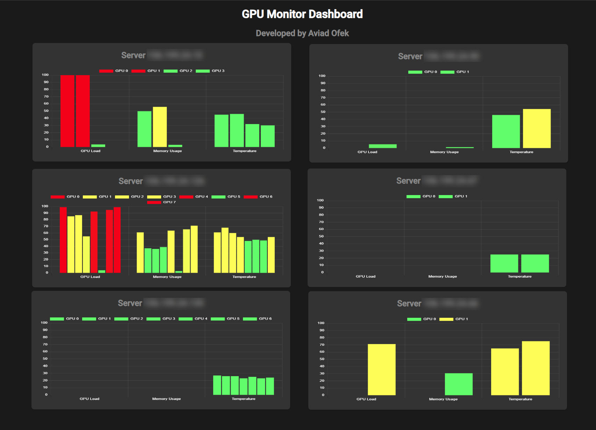

# GPU Monitor Dashboard

A dynamic and interactive GPU monitoring dashboard designed to track GPU utilization, memory usage, and temperature across multiple servers. This dashboard is built using HTML, CSS, JavaScript, and integrates Chart.js for real-time data visualization. It is tailored for both Windows and Linux environments.

## Features

- Real-time GPU monitoring
- Interactive charts for GPU Load, Memory Usage, and Temperature
- Responsive and draggable server widgets
- Dark theme for enhanced visibility

## Getting Started

These instructions will get you a copy of the project up and running on your local machine for development and testing purposes.

### Prerequisites

Before you begin, ensure you have the following components installed:

- Python (3.x recommended)
- Flask
- Paramiko (for handling SSH connections)
- Flask-CORS (for handling cross-origin requests in Flask)

You can install the required Python packages using pip:

```bash
python.exe -m pip install --upgrade pip
pip install Flask paramiko flask-cors
```

### Installation

#### Windows

1. Clone the repository to your local machine:
   ```bash
   git clone https://github.com/aviado1/GPU-Monitor-Dashboard.git
   ```
2. Navigate to the project directory:
   ```bash
   cd GPU-Monitor-Dashboard
   ```
3. Create a folder named `templates` in the same location as your `gpu_monitor.py` script.
4. Place the `dashboard.html` file inside the `templates` folder.
5. Start the Flask server. Navigate to the directory where `gpu_monitor.py` is located and run:
   ```bash
   python gpu_monitor.py
   ```
6. Open your web browser and visit `http://localhost:5000` to view the dashboard.

#### Linux

1. Clone the repository to your local machine:
   ```bash
   git clone https://github.com/aviado1/GPU-Monitor-Dashboard.git
   ```
2. Navigate to the project directory:
   ```bash
   cd GPU-Monitor-Dashboard
   ```
3. Start a local server using Python. For Python 3.x, you can use:
   ```bash
   python3 -m http.server 8000
   ```
4. Open your web browser and visit `http://localhost:8000` to view the dashboard.

## Configuration

Before you start the dashboard, configure your server details. Here are sample configurations:

```python
servers = [
    {'host': '192.168.1.50', 'username': 'username1', 'password': 'password123'},
    {'host': '192.168.1.51', 'username': 'username2', 'password': 'password123'},
    {'host': '192.168.1.52', 'username': 'username3', 'password': 'password123'},
    {'host': '192.168.1.53', 'username': 'username4', 'password': 'password123'},
    {'host': '192.168.1.54', 'username': 'username5', 'password': 'password123'},
    {'host': '192.168.1.55', 'username': 'username6', 'password': 'password123'}
]
```

## Usage

After launching the dashboard, it will automatically start fetching GPU data from your configured server endpoint. You can interact with each server's widget to view detailed GPU statistics.

## Author

This script was authored by [aviado1](https://github.com/aviado1).

## Disclaimer

This software is provided "as is", without warranty of any kind, express or implied, including but not limited to the warranties of merchantability, fitness for a particular purpose and noninfringement. In no event shall the authors or copyright holders be liable for any claim, damages or other liability, whether in an action of contract, tort or otherwise, arising from, out of or in connection with the software or the use or other dealings in the software.


